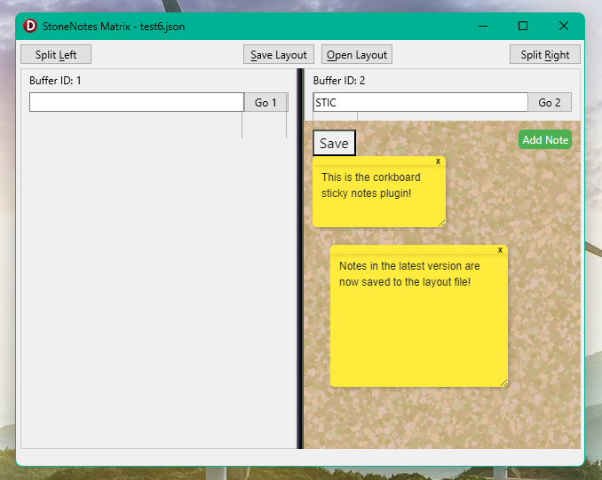

StoneNotes is a new way to organize your work:

Create easy to manage tiled layouts, mixing native controls such as memo fields with browser componets
that allow you to load anything -- from cloud IDEs to locally executed scripts.

Take notes while you browse and do much more.

Each tile contains a "buffer" which holds whatever component you want to load into it, triggered by short
text commands.

Current buffer commands are:
```
M - open a memo field
B - open a browser
STIC - Sticky Notes demo plugin (data not saved yet!)
```




